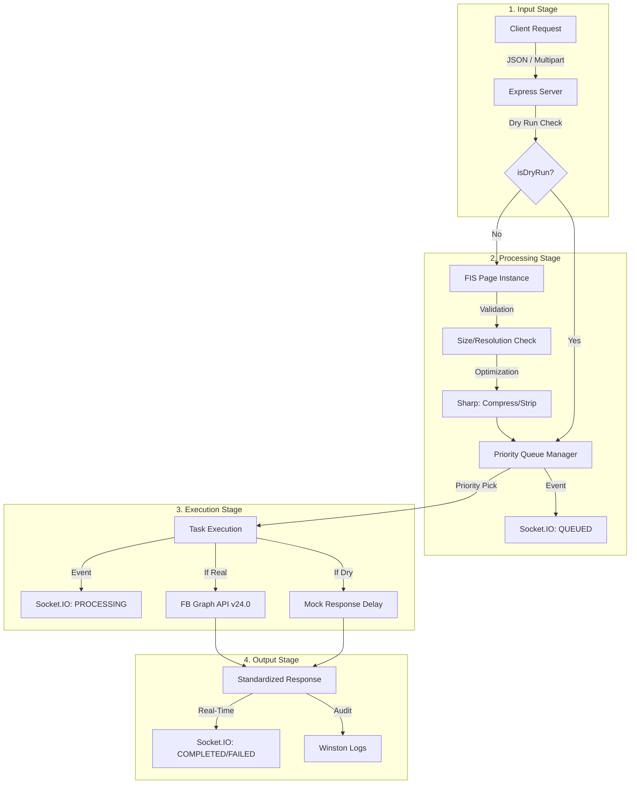

# Unified Facebook Manager (UFBM)

UFBM is a high-performance, multi-tenant Facebook gateway designed to centralize and optimize Page interactions across the PULSE ecosystem and beyond.

**Production Endpoint:** `https://ufbm.global-desk.top`
**Live Monitor:** `https://ufbm.global-desk.top`

---

## 📖 How to Use UFBM

UFBM operates as a secure proxy. You don't need to configure global credentials; instead, you pass the target Page ID and Token in the request headers.

### 1. Mandatory Headers
To target a specific Facebook Page, include these headers in every request:

| Header | Description |
| :--- | :--- |
| `x-fb-page-id` | The numeric ID of the target Facebook Page |
| `x-fb-token` | A valid Page Access Token with `pages_manage_posts` |

### 2. Standard Post (`POST /v1/post`)
Create a new post on the Feed (and optionally the Story). Supports JSON or Multipart (for images).

**Example Request (JSON):**
```json
{
  "caption": "🚨 SEVERE WEATHER ALERT: Signal #3 issued for...",
  "priority": 5,
  "options": {
    "publishToFeed": true,
    "publishToStory": true,
    "dryRun": false
  }
}
```

### 3. Authoritative Update (`POST /v1/post/:id/update`)
Edit an existing post to reflect revised data (e.g., Magnitude updates).

**Example Request:**
```json
{
  "caption": "🔔 AUTHORITATIVE UPDATE: Magnitude revised to 5.4.",
  "priority": 10,
  "dryRun": false
}
```

### 4. Media Uploads
When using `multipart/form-data`, attach your image/video to the `media` field. 
*   **Limit**: 1MB per file.
*   **Resolution**: Max 3000x3000px.
*   **Auto-Optimization**: UFBM automatically strips metadata and applies high-quality compression to ensure delivery.

---

## 🏗 Data Processing Flow



---

## 🧪 Testing with Dry Run
You can simulate a request without hitting the Facebook API by adding `"dryRun": true` to your payload. 
*   The API will return a mock `postId` (e.g., `DRY_RUN_abc123`).
*   The **Neural Monitor** will label the data packet as **"DRY"** for visual verification.

---

## 📡 Real-Time Monitoring
Visit the root URL (`https://ufbm.global-desk.top`) to view the **Neural Pipeline**.
*   **Aesthetic**: Retro-Cyber theme using **Tilt Neon** typography.
*   **Input/Output Docks**: Neon yellow headers and docking stations.
*   **Hex Hub**: A dual-line **Hot Pink** equilateral hexagon gear that rotates during processing.
*   **UFBM Core**: The central engine displays "UFBM" in **Facebook Neon Blue**.
*   **Auto-Cleanup**: Inactive project docks are gracefully removed after 10 seconds of silence.

---

## ⚡ Technical Specs
*   **Rate Limiting**: Sliding window control (default 10 posts/min per Page ID).
*   **Priority System**: `10` (Critical), `5` (High), `0` (Normal).
*   **API Version**: Facebook Graph API v24.0.
*   **Fail-Safe**: Automatic transition to text-only if media upload fails.

---

## 🛠 Quick Setup (Self-Hosting)
If you wish to run your own instance:
1. `pnpm install`
2. `pnpm dev` (Port 3005)
3. Build for production: `pnpm build`