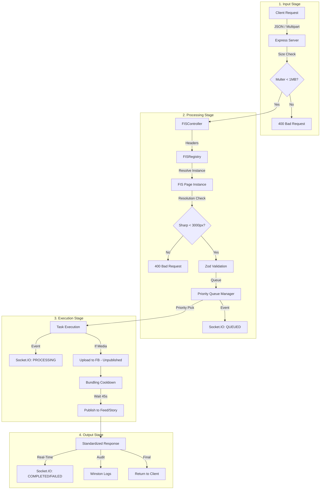

# Unified Facebook Manager (UFBM)

UFBM is a high-performance, multi-tenant Facebook gateway. It centralizes Facebook Page interactions for multiple projects, providing independent priority queues, real-time monitoring, and automatic "bundling prevention."

## 🚀 Key Features

*   **Multi-Tenancy**: Support multiple Facebook Pages simultaneously using request headers.
*   **Real-Time Monitor**: Built-in dashboard at `http://localhost:3005` to visualize input, processing, and output.
*   **Independent Queues**: Rate-limiting and the 45s "bundling delay" are applied per Page ID.
*   **Priority Lane**: Critical alerts (Tsunami/Mag 5+) jump to the front of the queue.
*   **Asset Validation**: Enforces 1MB file size and 3000x3000px resolution limits.
*   **Fail-Safe**: Automatic text-only fallback if media uploads fail.

## 🏗 Architecture & Data Flow



## 🛠 Setup & Installation

1.  **Install dependencies**
    ```bash
    pnpm install
    ```

2.  **Run the Server**
    ```bash
    # Development (with auto-reload)
    pnpm dev

    # Production (with PM2)
    pm2 start ecosystem.config.cjs --env production
    ```

## 📡 API Documentation (Port 3005)

### Required Headers (Multi-Tenancy)
To target a specific Facebook Page, include these headers in every request. If omitted, the server will attempt to use default credentials from the `.env` file.

| Header | Description |
| :--- | :--- |
| `x-fb-page-id` | The target Facebook Page ID |
| `x-fb-token` | Page Access Token with `pages_manage_posts` |

---

### 1. Create Post
`POST /v1/post`

Supports `application/json` or `multipart/form-data` (for media uploads).

**Request Body (JSON or Form-Data 'data' field):**
```json
{
  "caption": "🚨 Breaking Weather Alert...",
  "priority": 5,
  "options": {
    "publishToFeed": true,
    "publishToStory": false
  }
}
```

**Media Upload (Multipart):**
*   **Field Name**: `media`
*   **Limit**: Max 1MB per file, Max 3000x3000px resolution.

**Priorities:**
*   `10`: Critical (Tsunami, Mag 5+)
*   `5`: High (Weather, Mag 2+)
*   `0`: Normal (Summaries)

---

### 2. Authoritative Update (Edit Post)
`POST /v1/post/:id/update`

Used to revise an existing post (e.g., PHIVOLCS updates).

**Request Body:**
```json
{
  "caption": "🔔 AUTHORITATIVE UPDATE: Revised Magnitude 5.2...",
  "priority": 10
}
```

---

### 3. Queue Stats
`GET /v1/stats`

Returns the real-time status of all active Page queues.

---

## 📥 Standardized Response
Every API call returns a uniform response object:

```json
{
  "success": true,
  "postId": "123456789_987654321",
  "timestamp": "2026-02-10T12:00:00.000Z",
  "error": {
    "code": "ERROR_CODE",
    "message": "Detailed error message"
  }
}
```

## 🏗 Developer Notes
*   **Logs**: Stored in `logs/combined.log` and `logs/error.log`.
*   **UI**: The real-time dashboard is served statically from the `/` root.